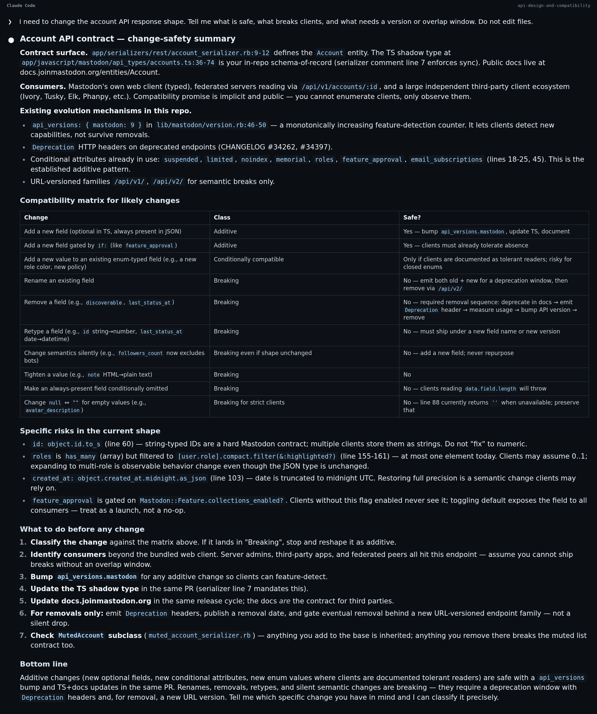
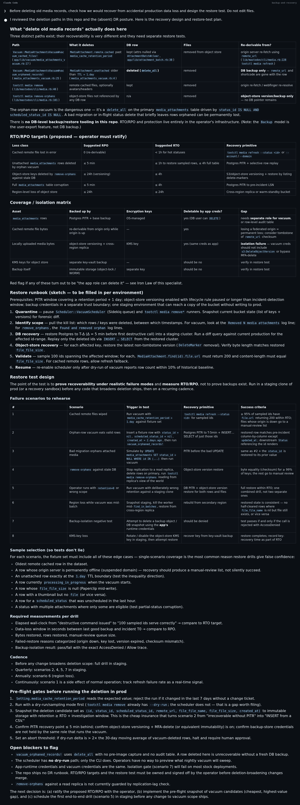
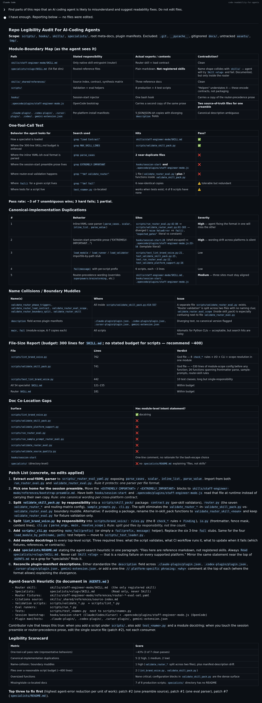
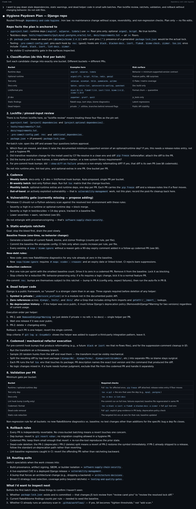
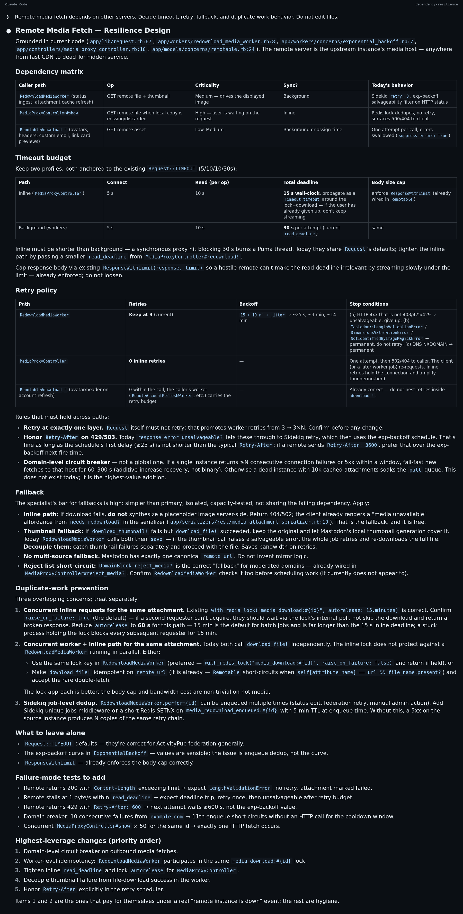
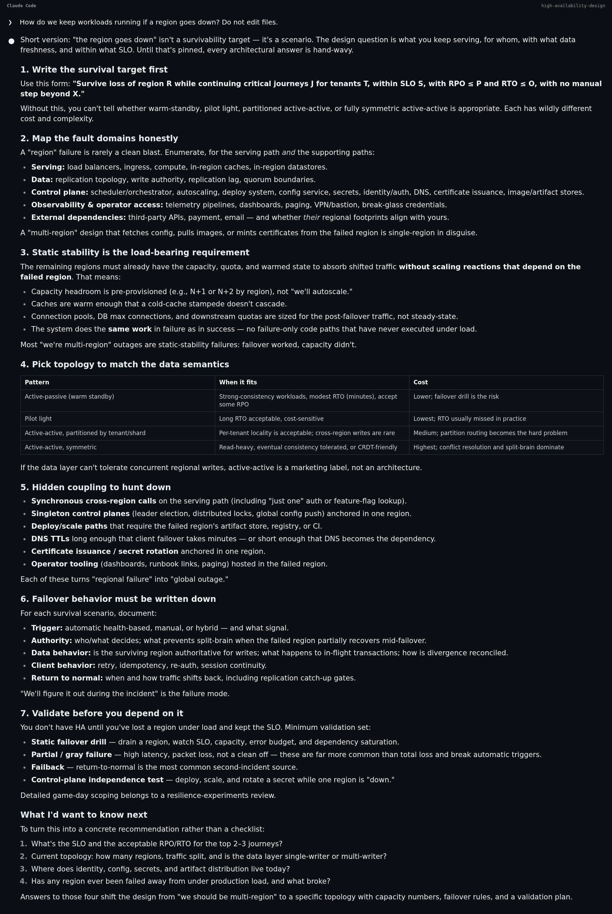
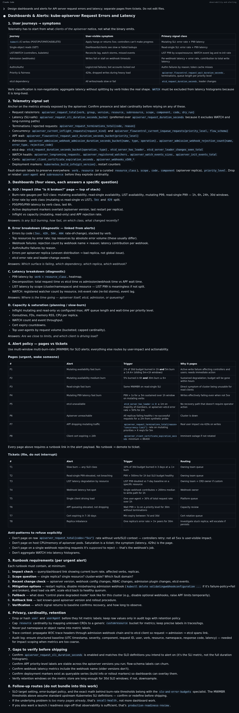
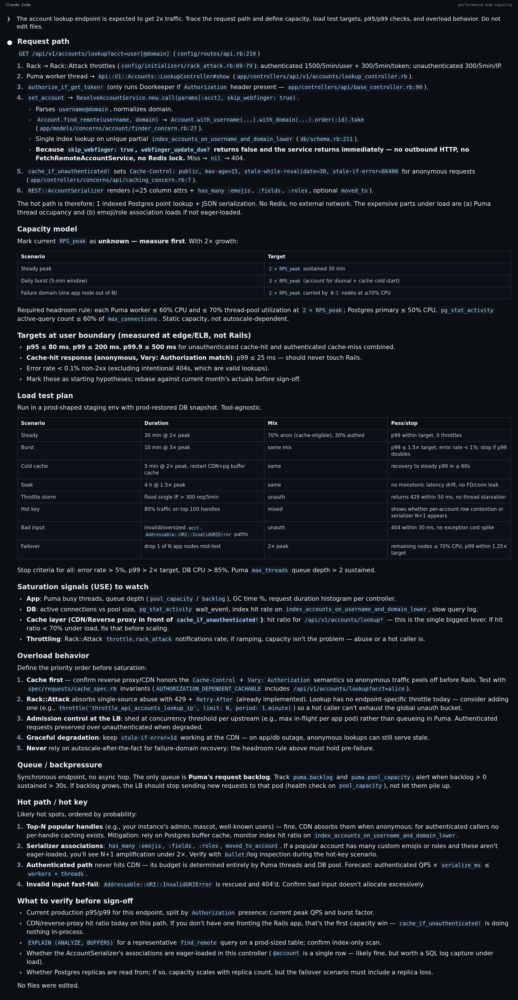
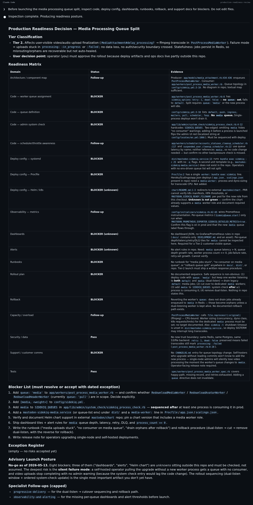

# Staff Engineer Mode

[](./RELEASE-NOTES.md)

**Your AI coding agent ships fast. This makes it ship with judgment.**

Staff-level engineering reasoning for design, development, testing, release, and operations decisions.

## Why Now

AI coding agents now write material amounts of production code. The bottleneck is no longer how fast the agent writes — it is whether the agent reasoned about what happens when the code runs at 3am. Agents will happily design an endpoint without a compatibility plan, implement a migration with no rollback, add tests that miss the failure mode, or ship a config change with no canary. This pack closes that gap.

## How It Works

Ask a normal engineering question. Hand the agent a task, design, diff, incident, rollout, or maintenance problem. The router reads the work, picks one specialist (occasionally one secondary), reads that specialist file, and returns concrete decisions, risks, checks, owners, supporting details, and next steps. You never name a specialist.

Supported tools should list only the native `staff-engineer-mode` router. Specialist files live under `specialists/` and load only after routing.

The router refuses to load every plausible specialist. One primary specialist at a time, by default.

See [SAMPLE-PROMPTS.md](SAMPLE-PROMPTS.md) for prompts across every specialist.

## What It Looks Like

These are real Claude Code captures from public codebases. The prompt is plain
developer wording; Staff Engineer Mode routes to one specialist, loads that
specialist file, and returns a structured engineering answer.

<details>
<summary>API compatibility review</summary>



</details>

<details>
<summary>Backup and recovery review</summary>



</details>

<details>
<summary>Code readability for agents review</summary>



</details>

<details>
<summary>Dependency and code hygiene plan</summary>



</details>

<details>
<summary>Dependency resilience review</summary>



</details>

<details>
<summary>High availability design</summary>



</details>

<details>
<summary>Observability and alerting review</summary>



</details>

<details>
<summary>Performance and capacity review</summary>



</details>

<details>
<summary>Production readiness before launch</summary>



</details>

## Installation

### Claude Code

Register the marketplace:

```text
/plugin marketplace add https://github.com/sirmarkz/staff-engineer-mode.git
```

Install the plugin:

```text
/plugin install staff-engineer-mode@staff-engineer-mode
```

### Codex

Works with Codex CLI and Codex App. Tell Codex:

```text
Fetch and follow instructions from https://raw.githubusercontent.com/sirmarkz/staff-engineer-mode/main/.codex/INSTALL.md
```

### Cursor

```text
/add-plugin staff-engineer-mode
```

### OpenCode

Works with OpenCode. Tell OpenCode:

```text
Fetch and follow instructions from https://raw.githubusercontent.com/sirmarkz/staff-engineer-mode/main/.opencode/INSTALL.md
```

### GitHub Copilot CLI

Register the marketplace:

```bash
copilot plugin marketplace add https://github.com/sirmarkz/staff-engineer-mode.git
```

Install the plugin:

```bash
copilot plugin install staff-engineer-mode@staff-engineer-mode
```

### Gemini CLI

```bash
gemini extensions install https://github.com/sirmarkz/staff-engineer-mode
```

## Verify

Start a fresh session inside any open repo and ask one of:

- "Before implementing partner webhooks, design the event contract, delivery retries, replay path, and dead-letter handling."
- "During development of the checkout inventory call, decide timeout, retry, fallback, and duplicate-work safeguards."
- "Review my last commit and tell me what you would catch in PR review."

The agent should load the router, choose one specialist, and respond with concrete decisions, risks, checks, owners, supporting details, and next steps — not vibes.

## What's Inside

One native router skill: `staff-engineer-mode`. It routes to 54 specialist
files under `specialists/`; those files are not installed or listed as separate
native skills.

Examples by surface (the full catalog with prompts for every specialist file is in [SAMPLE-PROMPTS.md](SAMPLE-PROMPTS.md)):

| Surface | Example specialist files |
| --- | --- |
| Architecture and interfaces | [`architecture-decisions`](specialists/architecture-decisions/SKILL.md), [`api-design-and-compatibility`](specialists/api-design-and-compatibility/SKILL.md), [`data-contracts`](specialists/data-contracts/SKILL.md), [`state-machine-correctness`](specialists/state-machine-correctness/SKILL.md) |
| Reliability and resilience | [`slo-and-error-budgets`](specialists/slo-and-error-budgets/SKILL.md), [`high-availability-design`](specialists/high-availability-design/SKILL.md), [`dependency-resilience`](specialists/dependency-resilience/SKILL.md), [`backup-and-recovery`](specialists/backup-and-recovery/SKILL.md), [`resilience-experiments`](specialists/resilience-experiments/SKILL.md), [`performance-and-capacity`](specialists/performance-and-capacity/SKILL.md) |
| Delivery and change safety | [`progressive-delivery`](specialists/progressive-delivery/SKILL.md), [`feature-flag-lifecycle`](specialists/feature-flag-lifecycle/SKILL.md), [`release-build-reproducibility`](specialists/release-build-reproducibility/SKILL.md), [`testing-and-quality-gates`](specialists/testing-and-quality-gates/SKILL.md), [`test-data-engineering`](specialists/test-data-engineering/SKILL.md), [`dev-environment-parity`](specialists/dev-environment-parity/SKILL.md), [`migration-and-deprecation`](specialists/migration-and-deprecation/SKILL.md), [`code-readability-for-agents`](specialists/code-readability-for-agents/SKILL.md), [`dependency-and-code-hygiene`](specialists/dependency-and-code-hygiene/SKILL.md), [`configuration-and-automation-safety`](specialists/configuration-and-automation-safety/SKILL.md), [`fleet-upgrades`](specialists/fleet-upgrades/SKILL.md) |
| Operations and observability | [`observability-and-alerting`](specialists/observability-and-alerting/SKILL.md) |
| Security and privacy | [`secure-sdlc-and-threat-modeling`](specialists/secure-sdlc-and-threat-modeling/SKILL.md), [`identity-and-secrets`](specialists/identity-and-secrets/SKILL.md), [`cryptography-and-key-lifecycle`](specialists/cryptography-and-key-lifecycle/SKILL.md), [`software-supply-chain-security`](specialists/software-supply-chain-security/SKILL.md), [`vulnerability-management`](specialists/vulnerability-management/SKILL.md), [`tenant-isolation`](specialists/tenant-isolation/SKILL.md), [`privacy-and-data-lifecycle`](specialists/privacy-and-data-lifecycle/SKILL.md) |
| Data and workflow systems | [`distributed-data-and-consistency`](specialists/distributed-data-and-consistency/SKILL.md), [`database-operations`](specialists/database-operations/SKILL.md), [`event-workflows`](specialists/event-workflows/SKILL.md), [`data-pipeline-reliability`](specialists/data-pipeline-reliability/SKILL.md), [`caching-and-derived-data`](specialists/caching-and-derived-data/SKILL.md) |
| Platform and edge | [`infrastructure-and-policy-as-code`](specialists/infrastructure-and-policy-as-code/SKILL.md), [`internal-service-networking`](specialists/internal-service-networking/SKILL.md), [`edge-traffic-and-ddos-defense`](specialists/edge-traffic-and-ddos-defense/SKILL.md), [`cost-aware-reliability`](specialists/cost-aware-reliability/SKILL.md) |
| Client, ML/AI, and experimentation | [`web-release-gates`](specialists/web-release-gates/SKILL.md), [`mobile-release-engineering`](specialists/mobile-release-engineering/SKILL.md), [`accessibility-gates`](specialists/accessibility-gates/SKILL.md), [`llm-application-security`](specialists/llm-application-security/SKILL.md), [`llm-evaluation`](specialists/llm-evaluation/SKILL.md), [`llm-serving-cost-and-latency`](specialists/llm-serving-cost-and-latency/SKILL.md), [`ml-reliability-and-evaluation`](specialists/ml-reliability-and-evaluation/SKILL.md), [`experimentation-and-metric-guardrails`](specialists/experimentation-and-metric-guardrails/SKILL.md) |
| Engineering workflow, readiness, and controls | [`agent-pr-review`](specialists/agent-pr-review/SKILL.md), [`ai-coding-governance`](specialists/ai-coding-governance/SKILL.md), [`documentation-lifecycle`](specialists/documentation-lifecycle/SKILL.md), [`engineering-control-evidence`](specialists/engineering-control-evidence/SKILL.md), [`production-readiness-review`](specialists/production-readiness-review/SKILL.md), [`incident-response-and-postmortems`](specialists/incident-response-and-postmortems/SKILL.md), [`oncall-health`](specialists/oncall-health/SKILL.md), [`platform-golden-paths`](specialists/platform-golden-paths/SKILL.md) |

Every specialist file appears in [SAMPLE-PROMPTS.md](SAMPLE-PROMPTS.md) with four representative prompts.

## Compared To Alternatives

Staff Engineer Mode can be used alongside workflow skills like Superpowers.
Workflow skills shape how the agent plans and executes; Staff Engineer Mode
shapes the engineering checks and decisions it applies to the work.

## Contributing

Patches welcome — especially additional practices from authoritative sources: first-party engineering publications, official documentation, standards bodies, peer-reviewed papers, or widely cited practitioner references.

New specialist files must be technology-agnostic, cite stable source IDs, and avoid vendor endorsement. Read [STYLE.md](STYLE.md) before opening a PR. The voice is enforced.

## Maintainers

See [MAINTAINERS.md](MAINTAINERS.md).

## Sources And Influences

This pack focuses on the intersection of the strongest publicly documented engineering practices from leading software engineering organizations. It synthesizes large-operator engineering writing (Google, Amazon, Meta, Microsoft, Apple, Netflix) and standards work cited by their teams (NIST, CISA, OWASP, OpenSSF, IETF, W3C). Specific source IDs are in `skills/_shared/references/source-index.md`. This is an independent project; nothing here is endorsed by or affiliated with those organizations.

## License

MIT — see [LICENSE](LICENSE). The project notice is included there.

---

*Fewer vibes. More engineering.*
